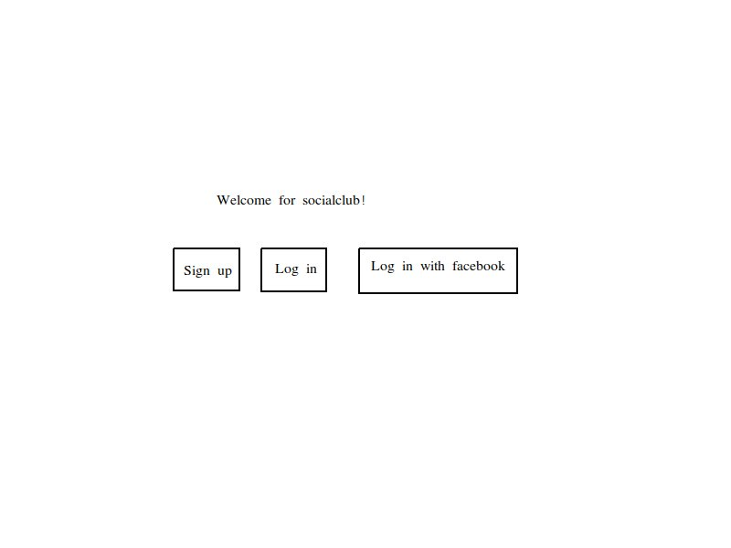
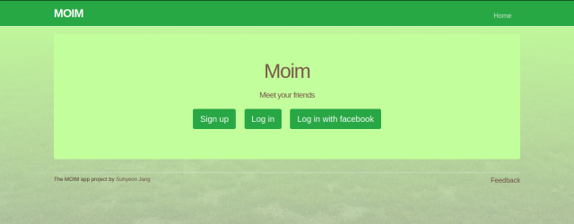
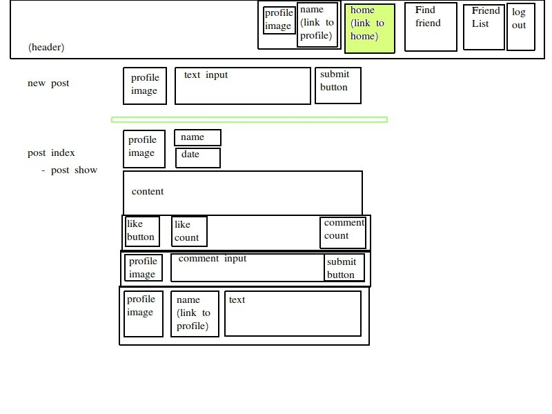
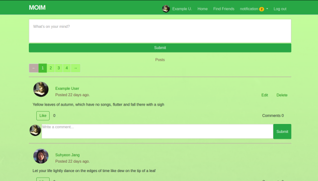
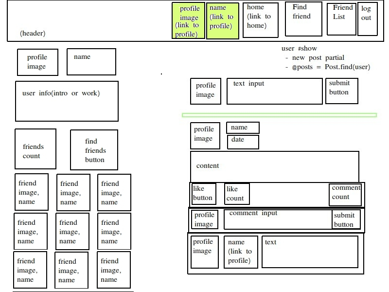
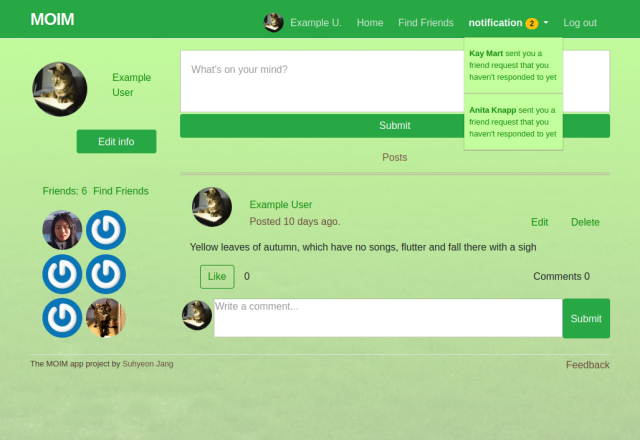
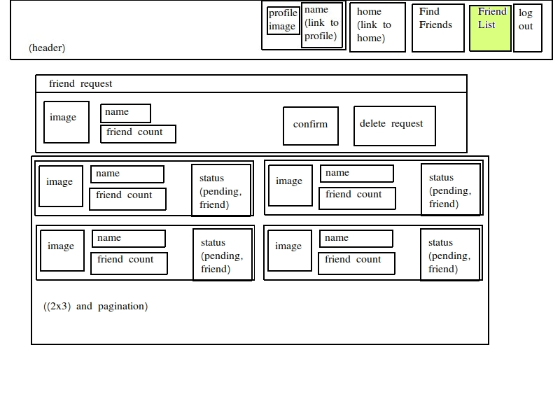
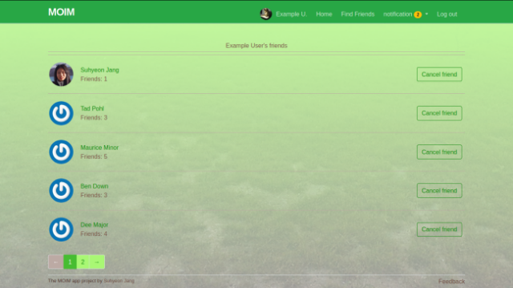
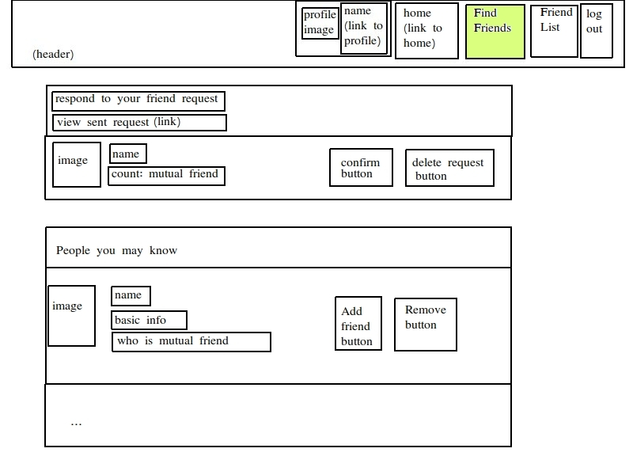
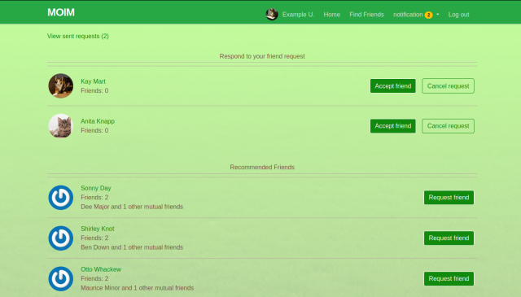

<h1 align="center">Welcome to Moim 👋</h1>

"Moim" is a Korean word meaning "gathering".<br />
It is a social application to build an online friendship.<br />
The background image has green coloured grass, and it feels like friends sit down on the grass gathering in the relaxed afternoon.<br />

This is part of the Final Project in [The Odin Project’s Ruby on Rails Curriculum](https://www.theodinproject.com/courses/ruby-on-rails/lessons/final-project).

This app was scheduled building with E-R diagram, user interface workflow design.

### E-R diagram


### User Interface workflow design

##### First page with no login




##### First page for logged-in user




##### User profile page




##### Friend list page




#### Find friend page





## Function description

- Home
  * not login user: access Sign-up / login / Facebook login
    + sign up: with full name(more than 2 words) / email / password
    + login: with email/password
    + login with Facebook: login with Facebook account
  * login user
    + write posts
    + see the posts which included in user or friends
      - like post
      - write comments
- Profile
  * user info: profile picture/name
  * friend info: friend count / 9th friend pic / all friend link('More') / 'Find Friend' link
  * the posts which were written by the profile's user
  * user self
    + edit user info: name / email / password / delete account
    + write / edit / delete post
  * others visiting one's page
    + able to request or accept friendship or seeing pending status
    + 'More': show all friends
- Find Friends
  * 'view sent request': pending friends, friendship requested, but wasn't accepted yet
  * 'Respond to your friend request': friend requests, waiting for acceptances for friendship
  * 'Recommended Friends': for someone who may know based on having mutual friends
  * 'New Friends': for someone who doesn't know with no mutual friends
- Notification: (n): received friendship request count
- Log out : user log out
- Feedback : user sends feedback to producer's email
- Additional description
  * profile picture
    + if a user logs in with Facebook, the user can see Facebook picture
    + if a user logs in without Facebook, the user has no picture
      (except user email having Gravatar account)

## Technology

- Ruby 2.6.3
- Rails 5.2.3
- Devise 4.7.1
- OmniAuth 1.9.0
- Bootstrap 4.0
- Sass 3.7.4
- PostgreSQL 10.10
- RSpec 3.8.0

## Deployment

#### [Live Demo](https://rails-moim-suh.herokuapp.com)
#### default account:
 - id: example-0@example.com
 - password: foobar

## Getting started

To get started with the app, clone the repository and then install the needed gems:

```
$ bundle install --without production
```

Next, migrate the database:

```
$ rails db:migrate
```

Then, load data from seed into the database:

```
$ rails db:seed
```

Finally, run the test suite to verify that everything is working correctly:

```
$ rails test
```

If the test suite passes, you'll be ready to run the app in a local server: <br />
When you used seed, example user info : email: "example-0@example.com", password: "foobar"

```
$ rails server
```

## Author

👤 **Suhyeon Jang**

- Github: [@shjang7](https://github.com/shjang7)
- Linked in: [@shjang](https://www.linkedin.com/in/shjang/)

## Contributing

1. Fork it (https://github.com/shjang7/moim/fork)
2. Create your feature branch (git checkout -b feature/[choose-a-name])
3. Commit your changes (git commit -am 'what this commit will fix/add')
4. Push to the branch (git push origin feature/[chosen-name])
5. Create a new Pull Request


## License

This project is licensed under the MIT License - see the [LICENSE](./LICENSE) file for details
